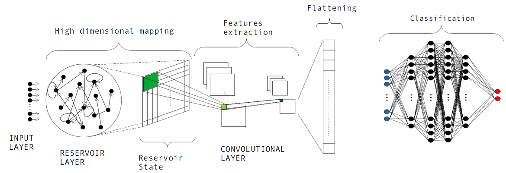

# CESN
A new neural network architecture for time series classification and regression. 

# CESN architecture
Here we present and describe in detail a new neural network architecture called CESN, Convolutional Echo State Network, which results from the combination of the Convolutional Neural Networks (CNNs) and the Echo State Networks (ESNs). CESN results to be appropriate for Time Series Classification (TSC) tasks and Time Series Regression (TSR) tasks, just changing the output activation function and the loss function of the model. 
CESN architecture in details is shown in the figure below 

* **Input layer**: It brings the input data, that can be univariate or multivariate timeseries, into the next layer.

* **Reservoir layer**: This layer aims to project the input data into a high dimensional space, trough temporal and non-linear activation functions of each neuron into the reservoir. This dimensional augmentation allows visualizing more patterns than the data in the original dimension. 

* **Convolutional layer**:
* **Flattening layer**:
* **Fully Connected layer**:

